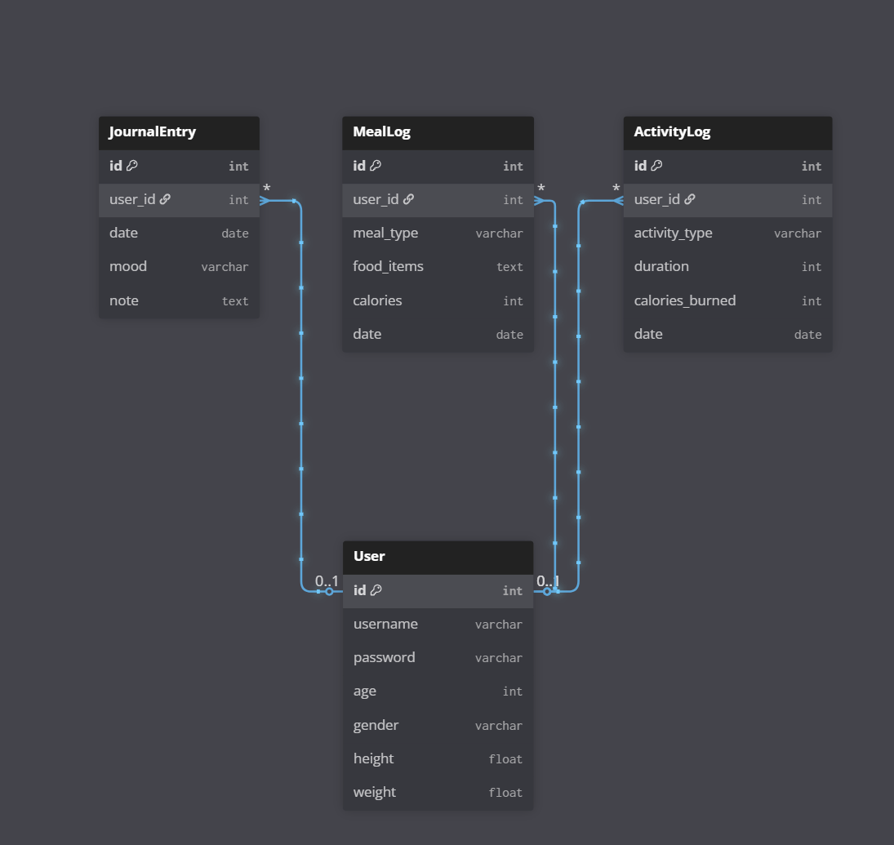

# Health & Wellness Tracker

## About

**_A full-stack Django CRUD application for tracking health, fitness, nutrition, and journaling._**

This project allows users to manage their health and wellness by logging activities, meals, and daily journal entries. The application demonstrates core CRUD functionalities, user authentication, and dynamic data rendering using Django.

Users can:
- Track daily physical activities
- Log meals with calories and details
- Maintain daily journal entries with mood tracking

This README provides an overview of the project, ERD, models, user stories, challenges, and future enhancements.

## Content
- [Models and Relationships](#models-and-relationships)
- [User Stories](#user-stories)
- [Challenges and Solutions](#challenges-and-solutions)
- [Future Features](#future-features)

## Models and Relationships

### ERD

**Relationships:**
- User → ActivityLog : 1–M
- User → MealLog : 1–M
- User → JournalEntry : 1–M

## User Stories
| Model | User Story |
|-------|------------|
| User | As a user, I want to create an account and enter my basic information (age, height, weight, gender) so that I can track my health and personal goals. |
| ActivityLog | As a user, I want to log my daily activities (e.g., walking, running, exercise) with duration and calories burned so that I can monitor my physical activity. |
| MealLog | As a user, I want to record my daily meals with food details and calories so that I can track my nutrition. |
| JournalEntry | As a user, I want to record daily notes and moods so that I can track my mental well-being and the impact of my health habits. |

## Challenges and Solutions
- **Maintaining consistent styling:** Created a global CSS file and used semantic HTML tags.
- **Managing multiple models with CRUD:** Carefully structured Django views, forms, and templates to handle data efficiently.

## Future Features
- Add HealthMetric model for tracking weight, blood pressure, heart rate, and sleep hours
- Implement reminders for daily habits
- Set and track health goals
- Add image or file uploads (e.g., profile pictures or meal photos)
- Advanced analytics and charts for activity, nutrition, and health trends
- Push notifications for reminders
- Unit tests for models and views

## Author
**Rama AlJufout**  
Email: aljufoutrama@gmail.com 
