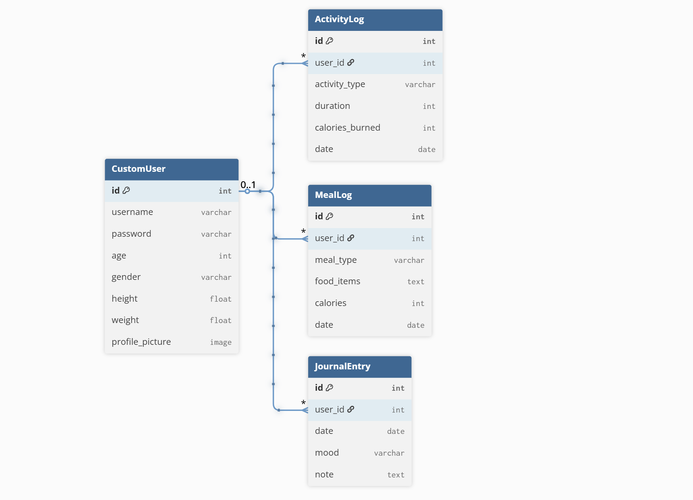
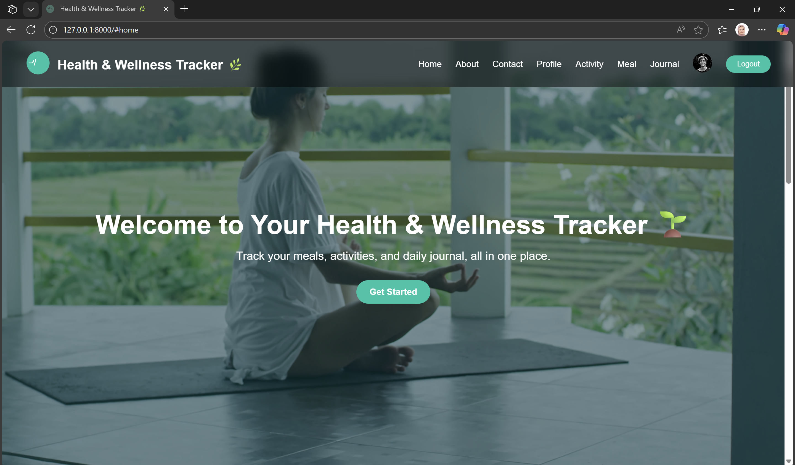
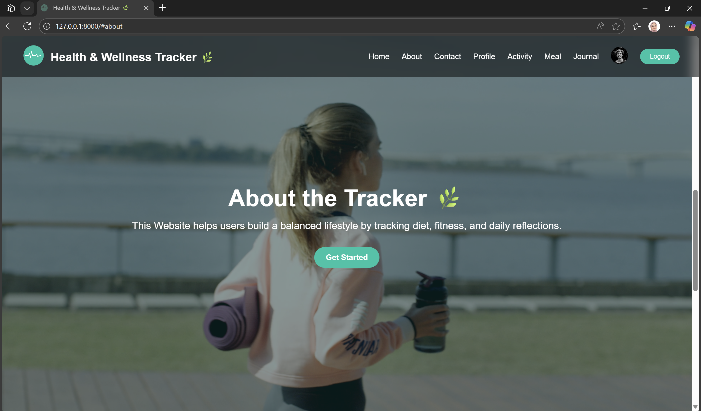
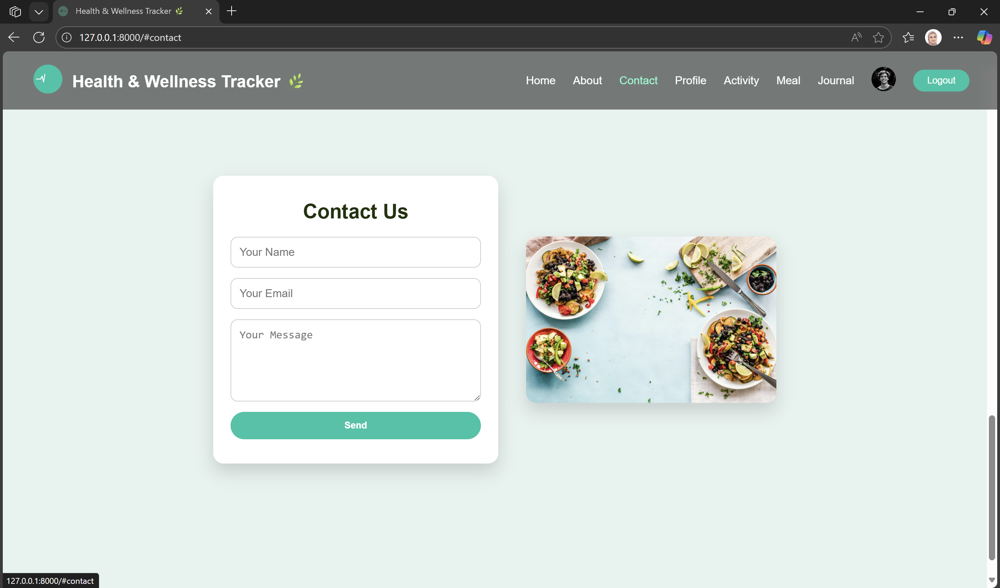
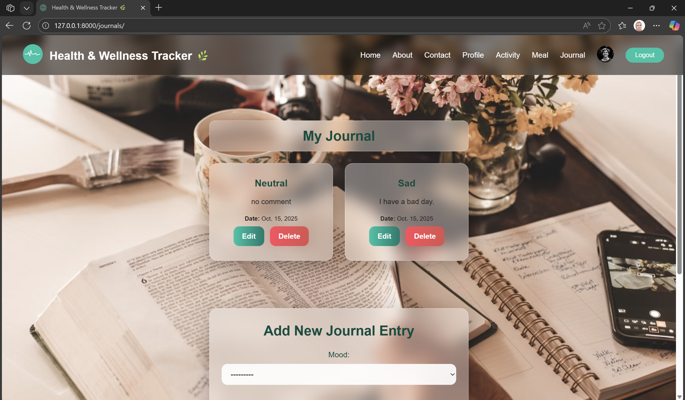

# Health & Wellness Tracker

## About

***A full-stack Django CRUD application for tracking health, fitness, nutrition, and journaling.***

This project allows users to manage their health and wellness by logging activities, meals, and daily journal entries. The application demonstrates core CRUD functionalities, user authentication, and dynamic data rendering using Django.

**Users can:**

* Track daily physical activities.
* Log meals with calories and details.
* Maintain daily journal entries with mood tracking.
* Register, login, and manage their account securely.

---

## Tech Stack

* **Backend:** Django.
* **Frontend:** HTML, CSS, Django Templates.
* **Database:** PostgreSQL.
* **Version Control:** Git & GitHub.

---

## Installation

1. **Clone the repository:**

   ```bash
   git clone https://github.com/Rama-AlJufout/Capstone-Project.git
   ```
2. **Navigate to project directory:**

   ```bash
   cd Capstone-Project
   ```
3. **Create and activate a virtual environment:**

   ```bash
   python -m venv env    
   ```
4. **Install dependencies:**

   ```bash
   pip install pipenv 
   pipenv install django
   pipenv install psycopg2-binary
   ```
5. **Apply database migrations:**

   ```bash
   python manage.py migrate
   ```
6. **Run the development server:**

   ```bash
   python manage.py runserver
   ```
7. **Open in browser:** `http://127.0.0.1:8000`

---

## Models and Relationships

### ERD



**Relationships:**

* User → ActivityLog : 1–M.
* User → MealLog : 1–M.
* User → JournalEntry : 1–M.

**Core Models:**

* `ActivityLog`: Tracks physical activities with duration and calories burned.
* `MealLog`: Records meals with food details and calories.
* `JournalEntry`: Stores daily notes, mood, and reflections.

---

## CRUD Functionality

* **Create, Read, Update, Delete** implemented for:

  * ActivityLog.
  * MealLog.
  * JournalEntry.
* Views, forms, and templates structured to handle each model efficiently.
* Only authenticated users can access their personal logs.

---

## Authentication

* Users can **register**, **login**, and **logout** using Django’s built-in authentication system.
* Access to activity, meal, and journal logs is restricted to authenticated users.

---

## Frontend

* **Semantic HTML** with proper indentation and structure.
* **Consistent CSS styling** across all pages.
* **Responsive design** using mobile-first media queries.
* Navigation menus provide smooth user flow between features.
* Dynamic data rendered using Django Template Language (DTL).

---

## User Stories

| Model        | User Story                                                                                                                                                    |
| ------------ | ------------------------------------------------------------------------------------------------------------------------------------------------------------- |
| User         | As a user, I want to create an account and enter my basic information (age, height, weight, gender, profile picture) so that I can track my health and personal goals.         |
| ActivityLog  | As a user, I want to log my daily activities (e.g., walking, running, exercise) with duration and calories burned so that I can monitor my physical activity. |
| MealLog      | As a user, I want to record my daily meals with food details and calories so that I can track my nutrition.                                                   |
| JournalEntry | As a user, I want to record daily notes and moods so that I can track my mental well-being and the impact of my health habits.                                |

---

## Challenges and Solutions

* **Maintaining consistent styling:** Created a global CSS for each Model and it contain all the style for HTML pages.
* **Managing multiple models with CRUD:** Structured Django views, forms, and templates carefully for data handling.
* **User authentication & access control:** Configured Django’s login_required decorators and redirect logic.

---

## Future Features / Stretch Goals

* Add `HealthMetric` model for tracking weight, blood pressure, heart rate, and sleep hours.
* Implement reminders for daily habits.
* Set and track personal health goals.
* Support image or file uploads meal photos.
* Advanced analytics and charts for activity, nutrition, and health trends.
* Push notifications for reminders.
* Unit tests for models and views.

---

## Demo Screenshots

**Home Page / Dashboard**




**Activity Log**


**Meal Log**


**Journal Entry**


---

## Version Control

* Hosted on **GitHub** with meaningful commits.
* **Feature branch workflow** with pull requests encouraged.
* Clear commit messages documenting project progress.

---

## Author

**Rama AlJufout**


Email: [aljufoutrama@gmail.com](mailto:aljufoutrama@gmail.com)

